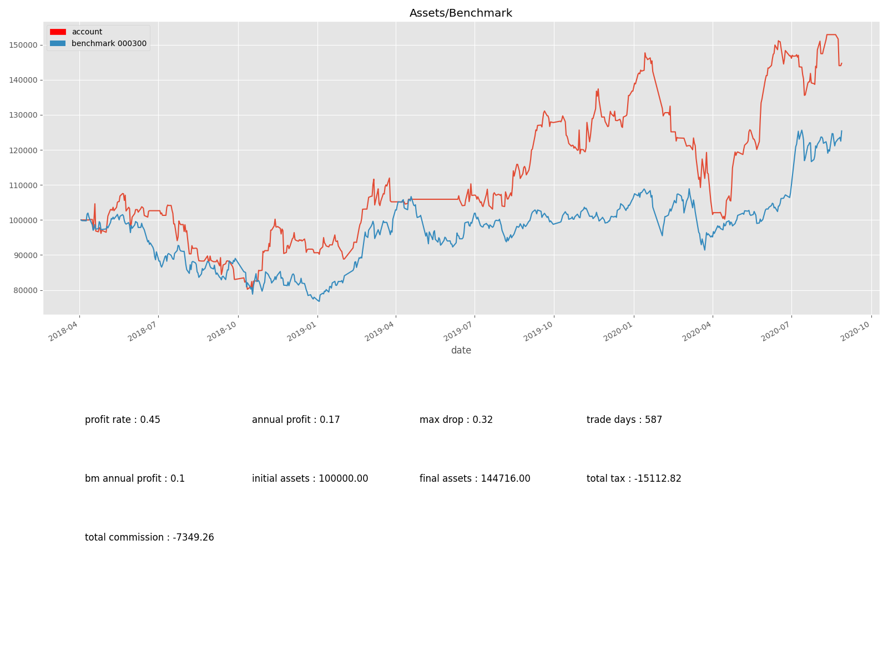

# gclient_ma_cross_enhanced 示例策略
此示例展示一个改进的双均线策略，代码量不到200行。

## 策略思路：
在前述最简单双均线策略中，买入卖出都按均线交叉当天的收盘价，我们知道A股的特点是不能做空，所以一定是吸筹缓慢，急速拉升后快速出货。
如果按照均线买卖，除非长牛股，否则基本不可能赚钱。所以我们改进为，均线上穿作为基本指标，买入则按其后几天内按某价位低吸，做超短线。

## 策略实现
至少先把ma_cross策略跑通，然后看代码实现。
先解释一下卖出策略。代码其实比较清楚了，直接按照英文句子翻译，意思就是：
首先如果持股1-2天内，有20%的涨幅止盈，如果有5%的跌幅止损。
否则如果在2-3天内收盘价卖出。
最后如果收盘价是跌停，假定是无法卖出的，那么后续任何一天只要收盘不跌停卖出。

需要重点解释的是MajcEnhancedBuy这个类，继承于一个基类，重载的方法解释如下：

update_buy_prices(self, data):
计算买入价。既然是低吸，设定一个比较低的价位。但你会说，这个价位有可能买不进，因为不能有未来函数。所以这里只是规定买入的最高价位，
超过这个价格我不买。

def get_final_buy_filter_on_buy_day(self, data):
这个函数返回一个过滤Series，其值True/False代表了当天应不应该买入。可以看到我们的实现判断了当天最低价是否低于上述假定的买入价，如果
不能低于买入价，直接过滤掉了。这里调用了下一个函数。

def get_buy_filter_before_buy_day(self, data):
这个函数其实同样是计算买入条件，只不过这里使用的一些指标应该是买入当天前一天的一些指标，实际上在ma_cross_enhanced.py中，这些指标都
后移了一天，所以在买入当天使用，就是前一天的数据，不会有未来函数。
注意jcA不是后移的指标，它表示今天是jc后的第几天。因为这个是按天数自动递增，可以是未来函数，这是唯一的例外。

def calc_and_forward_fill_buy_filter(self, data, extra=True):
这个函数很重要，是根据jc那天的指标先过滤大的买入条件，但是我们这个示例实际上没有做任何事情，只要是jc，就可以买入。
但你在调试策略时，这里是可以大做文章的，我们的主从指标系统，就在这里发挥。这是更高级的用法。

def get_price_func(self):
返回一个函数。被返回的函数其参数是data，返回值是从data得到一个价格的Series。因为我们已经设定了买入价为bpr，所以直接返回。

这样简单的一个策略，从2018年到2020年8月，也可以跑过沪深300指数，胜率55%。当然离可以放心实盘还有很大的距离。
如果你有心，也有那么点运气，是可以从中得到一个真正有效的策略的。

